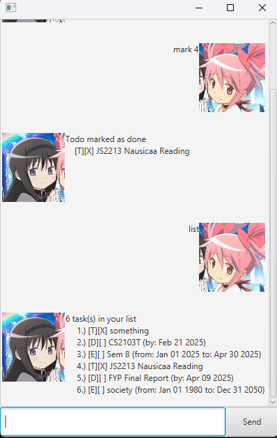

# Homura User Guide

[//]: # (https://stackoverflow.com/questions/41604263/
how-do-i-display-local-image-in-markdown)


Homura is a chatbot designed to help you keep track of your todo list in a fun 
and interactive manner.

Homura is able to keep track of 3 different kinds of tasks.
- A basic todo item
- A deadline with a due date
- An event with a start and end date

Users can add, edit, or delete a todo and mark or unmark them as 
done.

Each item on the todo list will be displayed to the user in the following 
forms
- Todo - `[T][ ] <description>`
- Deadline - `[D][ ] <description> (by: MMM DD YYYY)`
- Event - `[E][ ] <description> (from: MMM DD YYYY to: MMM DD YYYY)`

When an item is marked as done, the 2nd `[ ]` will be changed to `[✓]`.


# Commands Overview

The list of available commands is as follows.
- todo - Create a new todo
- deadline - Create a new deadline
- event - Create a new event
- mark - Mark an item as done
- unmark - Unmark an item (mark as not done)
- edit - Edit information regarding an item (cannot change todo type)
- delete - Delete an item from your todo list
- list - Lists out your entire todo list
- find - Find items in your list containing a certain text
- bye - Save your list and close the bot

Every command is called by sending a message of the form
```
command_name arguments
```
where the arguments are space separated and flags of the form `/flag` are 
sometimes used. 

Specifics on how to use each function is detailed below. Arguments enclosed 
in `[brackets]` are optional

# Todo Command

Create a new todo

Usage: `todo <description>`

Sample usage:
```
todo Watch Madoka Magica

Todo added
    [T][ ] Watch Madoka Magica
```

# Deadline Command

Create a new deadline

Usage: `deadline <description> /by YYYY-MM-DD`

Sample usage:
```
deadline Watch Madoka Magica /by 2025-03-31

Deadline added
    [D][] Watch Madoka Magica (by: Mar 31 2025)
```

# Event Command

Create a new event

Usage: `event <description> /from YYYY-MM-DD /to YYYY-MM-DD`

Sample usage:
```
event Madoka Magica Watch Marathon /from 2025-02-24 /to 2025-02-18

Event added
    [E][ ] Madoka Magica Watch Marathon (from: Feb 24 2025 to: Feb 18 2025)
```

# Mark Command

Mark an item as completed

Usage: `mark <index>`

Sample usage:
```
list

1 task(s) in your list
    1.) [T][ ] Watch Madoka Magica

mark 1

Todo marked as done
    [T][✓] Watch Madoka Magica
```

# Unmark Command

Unmark an item (mark as not done)

Usage: `unmark <index>`

Sample usage:
```
list

1 task(s) in your list
    1.) [T][✓] Watch Madoka Magica

unmark 1

Todo marked as not done
    [T][ ] Watch Madoka Magica
```

# Edit Command

Edit the information of an item in your todo list. The attributes that can be 
edited depend on the specific type of the item.

Usage for:
- Todos - `edit <index> [/des <new description>]`
- Deadlines - `edit <index> [/des <new description] [/by YYYY-MM-DD]`
- Events - `edit <index> [/des <new description} [/from YYYY-MM-DD] 
  [/to YYYY-MM-DD]`

Sample usage:
```
list

1 task(s) in your list
    1.) [D][✓] Watch Madoka Magica (by: 2025-02-28)

edit 1 /des Watch Hibike Euphoniium /by 2025-03-01)

Deadline 1 successfully modified
    [D][✓] Watch Hibike Euphonium (by: 2025-03-01)
```

# Delete Command

Delete an item from your todo list.

Usage: `delete <index>`

Sample usage:
```
list

2 task(s) in your list
    1.) [D][✓] Watch Madoka Magica (by: 2025-02-28)
    2.) [D][ ] Watch Hibike Euphonium (by: 2025-03-01)

delete 1

Deadline removed
    [D][✓] Watch Madoka Magica (by: 2025-02-28)
1 tasks(s) in your list
```

# List Command

Lists out the items in your todo list.

Usage: `list`

Sample usage:
```
list

3 task(s) in your list
    1.) [D][✓] Watch Madoka Magica (by: 2025-02-28)
    2.) [D][ ] Watch Hibike Euphonium (by: 2025-03-01)
    3.) [T][ ] CS2103T iP
```

# Find Command

Find command (currently buggy)

# Bye Command

Saves your todo list and closes Homura

Usage: `bye`

Sample usage:
```
bye

See you tomorrow, Kaname-san

Send any message to close me.
```

## *Manually Clearing Your List

The items in your list are stored locally in the file called 
`HomuraTodos.txt` in the root directory. Deleting this file or clearing out 
the contents will cause your todo list to get reset to an empty one.

[//]: # (# Duke User Guide)

[//]: # (// Update the title above to match the actual product name)

[//]: # (// Product screenshot goes here)

[//]: # (// Product intro goes here)

[//]: # (## Adding deadlines)

[//]: # (// Describe the action and its outcome.)

[//]: # (// Give examples of usage)

[//]: # (Example: `keyword &#40;optional arguments&#41;`)

[//]: # (// A description of the expected outcome goes here)

[//]: # (```)
[//]: # (expected output)
[//]: # (```)

[//]: # (## Feature ABC)

[//]: # (// Feature details)


[//]: # (## Feature XYZ)

[//]: # (// Feature details)
